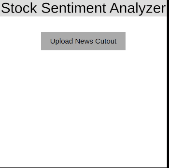

# Stock Sentiment Analysis using News Articles

## Idea
The idea is to analyze the image or screenshot of a news article and predict whether the stock price will go up or down.

## About the Web-App
Web-App is used to upload an image of the news article that needs to be analyzed. Then [Tesseract-OCR](https://github.com/tesseract-ocr/tesseract) is used to extract the text from the news article. The extracted text is used by an NLP model to predict whether the price will go up or down. The result gets displayed onto the screen.
 
## About the dataset used.
📌 The data set in consideration is a combination of the world news and stock price shifts available on Kaggle.

📌 The dataset contains news headlines ranging from 2000 to 2016.

📌 There are 25 columns of top news headlines for each day in the data frame.

📌 Class 1- the stock price increased.

📌 Class 0- the stock price stayed the same or decreased.

## About the approach.
📌 Used TF-IDF and Bag of Words for extracting features from the headlines.

📌 Used Random Forest Classifier, Multinational Naive Bayes, and Passive-Aggressive Classifier for analysis.

## Screenshots

